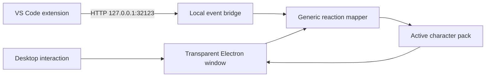

# Demo Ninja Desktop Pet

[](https://github.com/Keertilata20/Naruto-Desktop-Pet/actions/workflows/build.yml)
[](LICENSE)
[](#requirements)
[](#character-packs)

A small Electron desktop companion that stays above other windows, plays sprite
animations, and responds to local desktop and coding activity.

The public repository includes `demo-ninja`, an original mascot created for
demonstrating the desktop-pet engine. It does not distribute Naruto artwork or
any other third-party character assets.

This project builds on the architecture of
[TonyNa-code/desktop-pet](https://github.com/TonyNa-code/desktop-pet), with
additional work around replaceable packs, animation playback, local reactions,
capture privacy, and VS Code integration.

## Project scope

| Build | Character | Purpose |
| --- | --- | --- |
| Public repository | `demo-ninja` | Reproducible demo and contribution base |
| Local development | User-provided packs, including a private Naruto pack | Personal experimentation; not distributed here |

## Features

| Area | Included behavior |
| --- | --- |
| Desktop window | Transparent, always-on-top pet window with drag and directional movement |
| Animation | Idle, walking, waving, jumping, sleeping, and pack-defined actions |
| Interaction | Click, double-click, hover, and long-press reactions |
| Reactions | Local messages and mood-based action selection |
| Privacy | Optional hiding while screenshots or screen recordings are captured |
| Coding companion | Local VS Code events for tasks, terminal commands, debugging, saves, and coding activity |
| Character system | Discoverable, replaceable sprite-sheet packs with no character-specific engine code |
| Connectivity | Runs without an API key; the coding bridge listens only on localhost |

## Architecture



The application reads the active pack at runtime. Reactions request an action
by name, and the pack decides whether that action is available. This keeps the
engine reusable for both the public mascot and user-provided characters.

## Requirements

| Component | Requirement |
| --- | --- |
| Operating system | Windows 10 or Windows 11 |
| Runtime | Node.js and npm |
| Source control | Git, if cloning the repository |
| VS Code integration | VS Code 1.93 or newer for terminal shell events |

## Run from source

From the project directory:

```bash
npm install
npm start
```

The public build starts with `demo-ninja`. The application can be closed from
its tray/menu controls or by closing the Electron process.

Run the project checks with:

```bash
npm run check
```

The check command validates JavaScript syntax, character manifests and sprite
dimensions, and the repository privacy rules.

## VS Code integration

The optional extension in `vscode-extension/` sends selected coding events to
the running pet over `http://127.0.0.1:32123/event`. The bridge is local-only:
it does not upload source code, filenames, or event data to a cloud service.

### Install the extension

Build the VSIX from the project root:

```bash
npm run package:vscode
```

The generated file is:

```text
vscode-extension/desktop-pet-coding-companion.vsix
```

In VS Code, open the Command Palette and choose `Extensions: Install from
VSIX...`, then select that file. Start the pet with `npm start` before testing
events.

### Event mapping

| Event | Typical trigger | Example reaction |
| --- | --- | --- |
| Success | Successful task or terminal command | Celebration or jump |
| Error | Failed task or terminal command | Concern or reaction message |
| Debug start | A debug session begins | Ready or focused action |
| File saved | A file is saved, when enabled | Short acknowledgement |
| Coding pulse | Coding activity detected | Activity or focus reaction |

The extension also exposes manual commands beginning with `Desktop Pet:` so
the bridge can be tested without running a project. Terminal events depend on
VS Code shell integration being available. Events are deduplicated so one task
does not normally produce two visible reactions.

### Extension settings

| Setting | Default | Purpose |
| --- | --- | --- |
| `desktopPet.notifyOnTerminal` | `true` | React to integrated-terminal events |
| `desktopPet.notifyOnSave` | `false` | React when a file is saved |

Both the public `demo-ninja` pack and compatible local packs use the same event
bridge and reaction code. An action is selected only when the active pack
contains that action.

## Character packs

Each character is discovered from a folder under `assets/characters/<id>/`:

```text
assets/
└── characters/
    └── demo-ninja/
        ├── character.json
        ├── preview.png
        └── sprite.png
```

| File | Role |
| --- | --- |
| `character.json` | Pack metadata, sprite-sheet layout, states, frame counts, and timing |
| `preview.png` | Image shown in the character picker |
| `sprite.png` | Transparent sprite sheet containing the animation frames |

The manifest describes the grid and maps action names to rows or frame ranges.
New packs should follow the same format and use artwork that the pack creator
has permission to distribute.

## Local Naruto development pack

The Naruto pack is used in local development only and is intentionally excluded
from this public repository. The local path is:

```text
assets/characters/naruto/
```

Naruto is an unofficial personal fan project and is not affiliated with the
Naruto rights holders. The public engine does not contain Naruto-specific
code; a compatible local pack can be loaded through the same generic discovery
system.

## Capture privacy

The application includes a setting to hide the pet from screenshots and screen
recordings. The default is privacy-preserving: capture hiding is enabled. When
the setting is disabled, the pet remains visible in captures. The window is
restored after capture transitions so changing the setting does not permanently
hide the pet.

## Troubleshooting

| Problem | Check |
| --- | --- |
| `npm start` fails | Run it from the folder containing `package.json`, then run `npm install` |
| Pet does not react to VS Code | Start the desktop pet first and confirm the extension is installed and enabled |
| Terminal events do not arrive | Enable VS Code shell integration or use the extension's manual commands |
| The extension seems unchanged | Rebuild the VSIX, install the new file, and reload VS Code |
| A custom pack is not listed | Check the folder name, `character.json`, PNG files, and `npm run check` output |

## Useful commands

| Command | Purpose |
| --- | --- |
| `npm install` | Install project dependencies |
| `npm start` | Run the desktop pet |
| `npm run check` | Validate code, packs, and repository privacy rules |
| `npm run package:vscode` | Build the VS Code extension package |

## Development notes

The public repository is intended to remain runnable without private artwork.
Keep user-provided or locally generated character packs outside commits unless
their licensing permits redistribution. Changes to the generic engine should be
tested with `demo-ninja` and with any compatible local pack available to the
developer.

## Credits and license

The desktop-pet foundation is from
[TonyNa-code/desktop-pet](https://github.com/TonyNa-code/desktop-pet) and is
used under its MIT license. See [ASSET_NOTICE.md](ASSET_NOTICE.md) for the
asset and attribution notes that apply to this repository.

The original `demo-ninja` assets and the project changes in this repository are
provided for learning and experimentation under the repository's stated
license. Character artwork remains subject to its own licensing terms.
